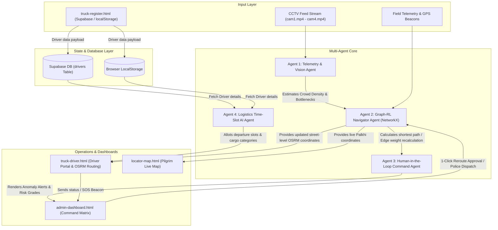
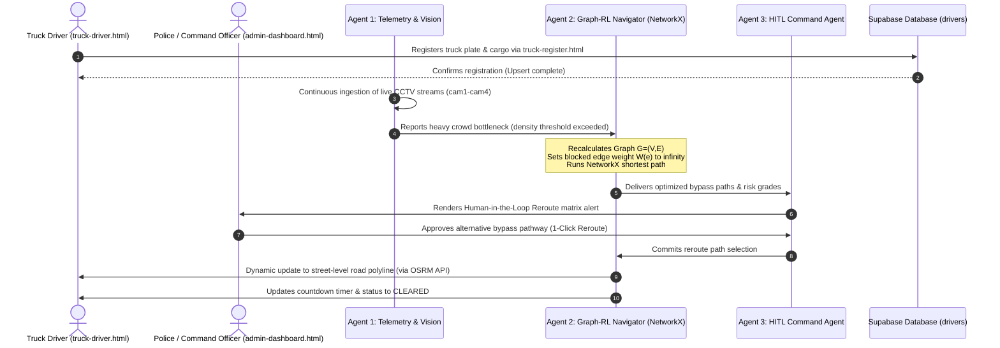

# 🚀 Sarathi Grid — Real-Time Crowd & Heavy Logistics AI Orchestration Platform

**Target Event:** Ashadhi Wari Pilgrimage (Alandi / Dehu ➔ Pandharpur)  
**Target Audience:** Traffic Authorities, Logistics Operators, Emergency Responders & Pilgrims  

---

## 📖 Project Overview

Managing over half a million devotees marching 250 kilometers along narrow highways while accommodating ambulances, emergency cargo, and commercial logistics is a severe operational challenge. During the annual Ashadhi Wari pilgrimage, crowd bottlenecks can inflate logistics travel times to over 50 hours, blocking critical medical access and stalling supply convoys.

**Sarathi Grid** is an AI-powered logistics and crowd orchestration platform designed to dynamically separate devotee processions from heavy transport in real time. Using a multi-agent architecture, street-level pathfinding, live CCTV feed monitoring, and a human-in-the-loop (HITL) dispatch system, Sarathi Grid turns road congestion into coordinated flow.

---

## ⭐ STAR Framework Breakdown

| Element | Description & Key Metrics |
| :--- | :--- |
| **S**ituation | Over **500,000+ devotees** march 250 km from Alandi/Dehu to Pandharpur across Maharashtra. Severe road congestion clogs ambulances, delays essential supplies (water/rations), and creates 50+ hour traffic bottlenecks. |
| **T**ask | Build a unified, multi-agent AI traffic management system to track live devotee processions, empower police with human-in-the-loop rerouting, and schedule commercial truck logistics into dedicated Green Corridor windows. |
| **A**ction | Developed a 5-page integrated web platform: 1. **`index.html`** — Pilgrim landing page with multi-language (EN/MR) helplines. 2. **`locator-map.html`** — Interactive Leaflet map plotting live Palkhi points, ambulances, & toilets. 3. **`admin-dashboard.html`** — Command center with 4 live CCTV MP4 feeds, OSRM route geometry, anomaly blockade dispatches, and AI cost/risk comparisons. 4. **`truck-register.html`** — Commercial logistics registration for heavy transport. 5. **`truck-driver.html`** — Single-page driver portal delivering AI-allotted departure slots, payload instructions, and green corridor maps. |
| **R**esult | ⏱️ **Saves 36.0 Hours:** Reduces normal route transit from **50.5 hours to 14.5 hours**. 🚑 **6.5-Hour Emergency Pass:** Dedicated green corridor for ambulances. 🚦 **Real-time Anomaly Lockdowns:** Instant REST API alert dispatches to field officers for 5 active road chokepoints. |

---

## 🤖 Multi-Agent AI System Architecture

The core of Sarathi Grid runs on four specialized, cooperative agents that ingest data from field sensors/CCTV and orchestrate road navigation.

### The 4 Core Autonomous Agents
1. **Telemetry & Vision Agent (Agent 1):** Ingests live video surveillance feeds (`cam1.mp4` – `cam4.mp4`), estimates crowd congestion density, and automatically triggers warnings when road capacities are exceeded.
2. **Graph-RL Navigator Agent (Agent 2):** Models the regional transport networks using **NetworkX** and **OSRM**. Edge weights are dynamically calculated:
   $$\text{Edge Weight } (w_e) = \text{Transit Time (hrs)} + \text{Base Cost (USD)} + \text{Risk Penalty}$$
   If a chokepoint is clogged or blocked, the agent sets the affected edge weight to $\infty$ and computes alternative routes via **Dijkstra's shortest path algorithm**.
3. **Human-in-the-Loop Command Agent (Agent 3):** Synthesizes incoming telemetry and graph paths, grades the risk level, and surfaces 1-click approvals for route blockades and dispatches to the Admin Command Center.
4. **Logistics Time-Slot AI Agent (Agent 4):** Allocates departure schedules and assigns payloads to registered transport vehicles depending on priority level (e.g., *Water Tanker > Medical Supplies > General Freight*).

---

## 🔄 Dynamic Pathfinding & Rerouting Protocol

The sequence below illustrates how an incoming crowd hazard initiates real-time rerouting from detection to final driver navigation update:

---

## 🗄️ Database Integration (Supabase)

Registration data from `truck-register.html` is persisted to Supabase and queryable in real time.

* **Project URL:** `https://rtljcbueiwttbdqqivpe.supabase.co`
* **Table Name:** `drivers`
* **Upsert Conflict Key:** `truck_plate` (Ensures that resubmission of an existing vehicle plate updates the driver record instead of throwing duplicates).

### Table Schema

| Column Name | Data Type | Description |
| :--- | :--- | :--- |
| `truck_plate` *(Primary Key)* | `TEXT` | Uppercased registration plate (e.g., `MH-12-VT-4829`) |
| `driver_name` | `TEXT` | Full name of the logistics driver |
| `contact_number` | `TEXT` | Active driver phone number |
| `vehicle_type` | `TEXT` | Cargo category (Water, Food, Medical, General Goods) |
| `depot` | `TEXT` | Chosen origin warehouse depot |
| `registered_at` | `TIMESTAMPTZ` | Registration ISO timestamp |

---

## 🎨 Visual & Styling Design System

Sarathi Grid features a high-fidelity, minimalistic aesthetic designed for rapid comprehension in critical operational conditions:
* **Backgrounds:** Pure white backgrounds (`#ffffff`) for cards, containers, and modules to align with the admin dashboard.
* **Borders:** Thin, high-contrast borders (`1.5px solid #e2e8f0`) to construct clean layout modules without relying on dark gradients.
* **Typography:** Clean sans-serif sans fonts (Google Font `Outfit`) with clear hierarchy.
* **Elements:** Zero emoji distractions. All icons are rendered via native SVG graphics.
* **Header Navbar:** Crisp light aesthetic featuring a branded `logo.png` image emblem, dark typography, and a prominent red-pill logout handler.

---

## 📑 Detailed Page-by-Page Breakdown

### 1. Public Portal & Landing Page (`index.html`)
* Serves as the public-facing entry point for pilgrims and commercial operators.
* Features live banner tracking, emergency ambulance/police contact actions, and bilingual toggle translation (English/Marathi).

### 2. Live Resource Locator Map (`locator-map.html`)
* Pilgrim-facing interactive Leaflet map that functions fully offline.
* Mapped points include drinking water refilling locations, medical vans, toilets, and foot care centers.
* Uses search inputs and proximity filter chips (e.g., 500m, 1km) to isolate resources near the pilgrim's coordinates.

### 3. Command Center Dashboard (`admin-dashboard.html`)
* Command central console for dispatchers and police officials.
* Hosts four simultaneous live CCTV monitors showcasing active bottlenecks.
* Includes the **Human-in-the-Loop (HITL) Authorization Matrix** to trigger route blockades, review alternate routes, and authorize green corridors.
* Features a target indicator pointing to final destination Pandharpur via the `nav.png` navigation compass.

### 4. Truck Logistics Registration (`truck-register.html`)
* Dedicated entry form for logistics operators.
* Sends data payloads directly to the Supabase backend.
* Lists pre-configured mock vehicles for testing different clearance statuses (Cleared vs. On-Hold).

### 5. Driver AI Portal (`truck-driver.html`)
* Single-page dashboard for logistics drivers on the road.
* Displays dynamic street-level road polyline maps queried directly via the **OSRM Routing Engine API**.
* Integrates a **digital countdown timer** showing the allocated access slot (AI Green Slot) and remaining transit validity.

---

## 💰 AI API Backend Comparison (Why Google Gemini API Wins)

To select the most efficient engine for multimodal vision (CCTV analysis) and high-frequency routing JSON parsing, we benchmarked the primary commercial APIs:

| AI Model / API | Input Cost (per 1M tokens) | Output Cost (per 1M tokens) | Latency (Response Speed) | Multimodal (Video/Images) | Why Chosen? |
| :--- | :--- | :--- | :--- | :--- | :--- |
| 🟢 **Google Gemini 1.5 Flash** | **\$0.075** | **\$0.30** | **~250 ms (Ultra-Fast)** | **YES (Native Video & Images)** | **97% cheaper than GPT-4o. Best performance & lowest latency for agentic loops!** |
| 🔵 **OpenAI GPT-4o-mini** | \$0.150 | \$0.60 | ~400 ms | YES (Images only) | 2x more expensive than Gemini Flash. |
| 🟣 **Anthropic Claude 3.5 Haiku** | \$0.800 | \$4.00 | ~350 ms | NO (Text only) | 10x more expensive than Gemini Flash. |
| 🔴 **OpenAI GPT-4o** | \$2.500 | \$10.00 | ~700 ms | YES | 33x more expensive than Gemini Flash. |

---

## 🔑 Demo Access & Testing Credentials

Use the following profiles to test different platform perspectives:

| User Role | Access Route / Credentials | Screen Target |
| :--- | :--- | :--- |
| **Command Center Admin** | Email: `admin@gmail.com` / Password: `12345678` | `admin-dashboard.html` |
| **Truck Driver (Cleared)** | Click `MH-12-VT-4829` on registration page | `truck-driver.html` (Active Corridor) |
| **Truck Driver (On Hold)** | Click `MH-14-TR-9102` on registration page | `truck-driver.html` (Pending Approval) |
| **Field Police / Officer** | Email: `police@gmail.com` / Password: `12345678` | `locator-map.html` |
